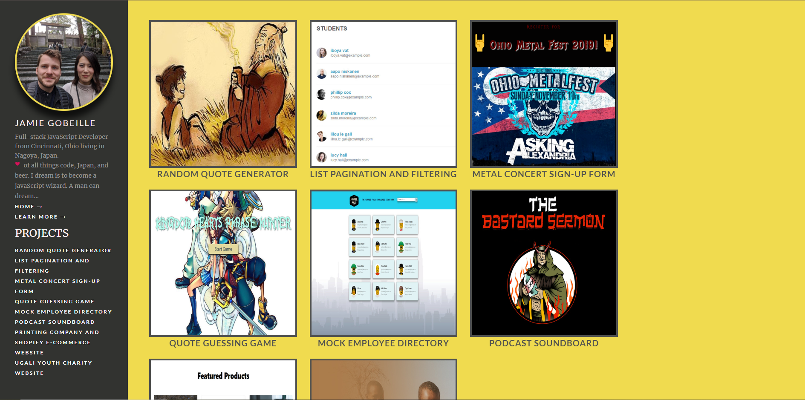

# node-portfolio-site

---

This project is a modern portfolio page built using node.js to handle routing and effective error handling. Node.js is an essential tool for any Full-stack JavaScript Developer to know.

For a live demo if this project, go to this link: https://jamie-portfolio-site.herokuapp.com/

## Motivation

---

The motivation of this project is to highlight knowledge of Node.js, working with the backend, design skills and to showcase all of my projects I have ever done.

This project taught me how to:

- Use express to set up a server and routing
- Using back-end code(Node.js) to connect everything
- Error Handling
- Use npm to import dependencies
- Working with Pug Templates
- Parse JSON data to be able to be used in Pug Templates
- Deploying a web app with Heroku
- Set up the middleware to utilize static files like CSS and images

## Technology Used

---

This project uses the following technologies:

- HTML
- CSS
- JavaScript
- Back-end JS(Node.js)
- Pug
- Express
- Middleware
- Heroku(To deploy)

## Features

---

1. Modern web development using Node.js to build a web application
2. Pug templates to make reusable page templates instead of redundant copying and pasting of headers and footers
3. Showcases live examples of all my past projects
4. Uses Express to create a server and create routing
5. Dynamic error handling. Users will be directed to error page when they try to visit pages that don't exist

## Code Example

---

Dynamic Error Handling

```
app.use((_req, _res, next) => {
  const err = new Error('Not Found');
  err.status = 404;
  console.log(err);
  next(err);
});

// eslint-disable-next-line no-unused-vars
app.use((err, _req, res, _next) => {
  res.locals.projects = projects;
  res.locals.error = err;
  if (err.status >= 100 && err.status < 600) res.status(err.status);
  else res.status(500);
  console.log(err);
  res.render('error', projects);
});
```

Pug Templates used to create each project page dynamically instead of hard coding everything

```
extends layout.pug

block content
  nav.grid-container.portfolio-breadcrumb
    a(href='/') ← Back
  article.grid-container.portfolio-intro.portfolio-project
    .grid-x
      .cell.small-6.medium-9.large-9

        h1 #{project.project_name}

        p.lead.text-light
          | #{project.description}

      .cell.portfolio-meta.small-6.medium-2.large-3
        h6 Technologies

        technologies used in each project.
        each technology, i in project.technologies
          ul
            li #{project.technologies[i]}


        a.button.expanded(href=`${project.live_link}`) Live Demo
        if project.github_link
          a.button.expanded(href=`${project.github_link}`) GitHub Repo
        else


    each image in project.image_Urls
      if typeof image === 'object'
        continue
      else
        img.image(src=`${image}`)


```

## Screenshots

---




## Style Changes

---

The following style changes to the original Treehouse project are as noted:

1. Colors changed
2. Font style and sizes altered
3. CSS animations added to project calls on index page
4. CSS animations added profile image
5. Logo added
6. Color scheme changed
7. Added projects to side navbar and extra routing back to home page

## License

---

MIT © Jamie Gobeille 2020
